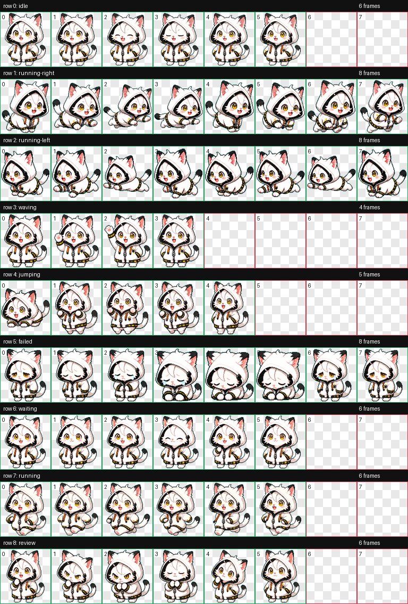

# ネコチャン Codex Pet

ネコチャン is a custom animated pet for the Codex app.

## Files

- `pet.json` - pet manifest
- `spritesheet.webp` - Codex-compatible animated pet spritesheet
- `contact-sheet.png` - QA contact sheet showing all animation frames

## Install

Copy this folder into your Codex pets directory:

```sh
mkdir -p ~/.codex/pets/nekochan
cp pet.json spritesheet.webp ~/.codex/pets/nekochan/
```

Then restart or reload Codex and select `ネコチャン` from the pet list.

## Build Notes

- Atlas size: `1536x1872`
- Cell size: `192x208`
- States: idle, running-right, running-left, waving, jumping, failed, waiting, running, review
- Validation: generated with the hatch-pet workflow; atlas validation and frame review passed with no errors or warnings.

## Preview


